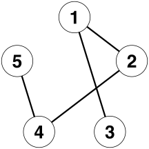
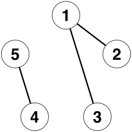
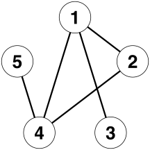
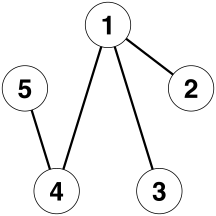
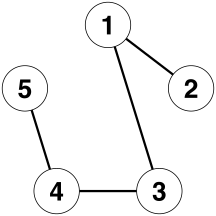

# :dart: dgaFast: Multiple Systems Estimation Using Decomposable Graphical Models

<!-- badges: start -->
[](https://travis-ci.com/OlivierBinette/dga)  [](https://github.com/OlivierBinette/dga/actions) 
<!-- badges: end -->

Efficient re-implementation of the `dga` package of James Johndrow, Kristian Lum and Patrick Ball (2015): "Performs capture-recapture estimation by averaging over decomposable graphical models. This approach builds on Madigan and York (1997)." 

Higher performance is needed to account for linkage errors through linkage-averaging and for simulation studies.

**Note:** the stratification functions and Venn diagram plotting functions from the `dga` package have not been reproduced in `dgaFast`. They can be accessed through `install.packages("dga"); library(dga)`.

## Example usage

Five lists example from Madigan and York (1997) as implemented in the `dga` package:

```r
library(dgaFast) # Re-implements library(dga)

# Number of lists and prior hyperparameter
p = 5
data(graphs5) # Decomposable graphical models on 5 lists.
delta = 0.5
Nmissing <- 1:300 # Reasonable range for the number of unobserved individuals.

# Counts corresponding to list inclusion patterns.
Y = c(0,27,37,19,4,4,1,1,97,22,37,25,2,1,3,5,83,36,34,18,3,5,0,2,30,5,23,8,0,3,0,2)
Y <- array(Y, dim=c(2,2,2,2,2))

# Model-wise posterior probaiblities on the total population size.
# weights[i,j] is the posterior probability for j missing individuals under model graphs5[[j]].
weights <- bma.cr(Y,  Nmissing, delta, graphs5)

# Plot of the posterior distribution.
plotPosteriorN(weights, sum(Y) + Nmissing)
```

<center>
   
</center>

Table of top model estimates.

```r
htmlSummary("./figures/posteriorSummary/summaryTable.html", weights, N, nrows=5, graphs=graphs5)
```

<center>
<!-- html table generated in R 3.6.3 by xtable 1.8-4 package -->
<!-- Sun Oct  4 11:35:10 2020 -->
<table>
<tr> <th> Model </th> <th> Posterior prob. </th> <th> Bayes est. </th> <th> Mode </th> <th> 0.025 </th> <th> 0.975 </th>  </tr>
  <tr> <td align="right">  </td> <td align="right"> 0.22 </td> <td align="right"> 715.79 </td> <td align="right"> 713.00 </td> <td align="right"> 687.00 </td> <td align="right"> 752.00 </td> </tr>
  <tr> <td align="right">  </td> <td align="right"> 0.16 </td> <td align="right"> 704.28 </td> <td align="right"> 703.00 </td> <td align="right"> 680.00 </td> <td align="right"> 734.00 </td> </tr>
  <tr> <td align="right">  </td> <td align="right"> 0.08 </td> <td align="right"> 702.08 </td> <td align="right"> 699.00 </td> <td align="right"> 675.00 </td> <td align="right"> 737.00 </td> </tr>
  <tr> <td align="right">  </td> <td align="right"> 0.07 </td> <td align="right"> 698.63 </td> <td align="right"> 697.00 </td> <td align="right"> 674.00 </td> <td align="right"> 729.00 </td> </tr>
  <tr> <td align="right">  </td> <td align="right"> 0.05 </td> <td align="right"> 704.95 </td> <td align="right"> 703.00 </td> <td align="right"> 680.00 </td> <td align="right"> 736.00 </td> </tr>
   </table>
</center>


## Performance gain

On a 2013 MacBook Pro 2.6 GHz Intel Core i5, the main routine of `dgaFast` is about 75 times faster than `dga`.

```r
if (!require(pacman)) install.packages("pacman")
pacman::p_load(bench, dga)

bench::mark(
     dga::bma.cr(Y, Nmissing, delta, graphs5),
     dgaFast::bma.cr(Y, Nmissing, delta, graphs5), 
     min_iterations=10, check=FALSE)
```

<center>
<table>
 <thead>
  <tr>
   <th style="text-align:left;"> expression </th>
   <th style="text-align:right;"> min </th>
   <th style="text-align:right;"> median </th>
   <th style="text-align:right;"> itr/sec </th>
   <th style="text-align:right;"> mem_alloc </th>
   <th style="text-align:right;"> gc/sec </th>
  </tr>
 </thead>
<tbody>
  <tr>
   <td style="text-align:left;"> dga </td>
   <td style="text-align:right;"> 866.8ms </td>
   <td style="text-align:right;"> 919.6ms </td>
   <td style="text-align:right;"> 0.994153 </td>
   <td style="text-align:right;"> 55.32MB </td>
   <td style="text-align:right;"> 9.444453 </td>
  </tr>
  <tr>
   <td style="text-align:left;"> dgaFast </td>
   <td style="text-align:right;"> 11.3ms </td>
   <td style="text-align:right;"> 12.5ms </td>
   <td style="text-align:right;"> 76.286860 </td>
   <td style="text-align:right;"> 2.17MB </td>
   <td style="text-align:right;"> 1.956073 </td>
  </tr>
</tbody>
</table>
</center>

## Installation

From GitHub:
```r
if (!require(devtools)) install.packages("devtools")
devtools::install_github("OlivierBinette/dgaFast")
```

## References
- James Johndrow, Kristian Lum and Patrick Ball (2015). dga: Capture-Recapture
  Estimation using Bayesian Model Averaging. _R package version 1.2._
  https://CRAN.R-project.org/package=dga
- David Madigan and Jeremy C. York (1997) Bayesian methods for estimation of the size of a closed population. _Biometrika_. Vol. 84, No. 1 (Mar., 1997), pp.
19-31
- Mauricio Sadinle (2018) Bayesian propagation of record linkage uncertainty into population size estimation of human rights violations. _Annals of Applied Statistics_ Vol. 12 No. 2  pp. 1013-1038
